# Приложение для учета приема лекарств

📋 Содержание
- [Как это работает](#как-это-работает-🛠️)
- [Обзор и скриншоты](#обзор-и-скриншоты-)
- [Используемые технологии](#используемые-технологии-)
- [С какими сложностями пришлось столкнуться](#с-какими-сложностями-пришлось-столкнуться-)
- [Что я узнал](#что-я-узнал-)
- [Установка и настройка](#Установка-и-настройка-)
- [Планы на будущее](Планы-на-будущее-)

---

## Как это работает 🛠️

Это приложение на React Native позволяет пользователям создавать, редактировать и удалять напоминания о приеме лекарств и добавок.

Приложение поддерживает:
- Регистрацию, вход и выход из системы
- Автоматический вход при повторном запуске приложения
- Создание напоминаний с push-уведомлениями через Expo
- Отслеживание приема лекарств с визуализацией прогресса
- Работу уведомлений даже когда приложение закрыто

---

## Обзор и скриншоты 📸

| Загрузочный экран| Экран авторизации | Экран регистрации | Главная страница|
|:-------------------------:|:-------------------------:|:-------------------------:|:-------------------------:|
|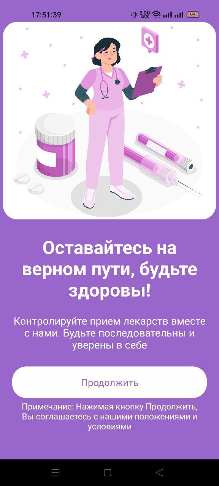|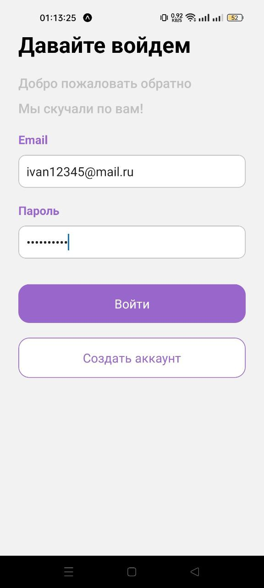|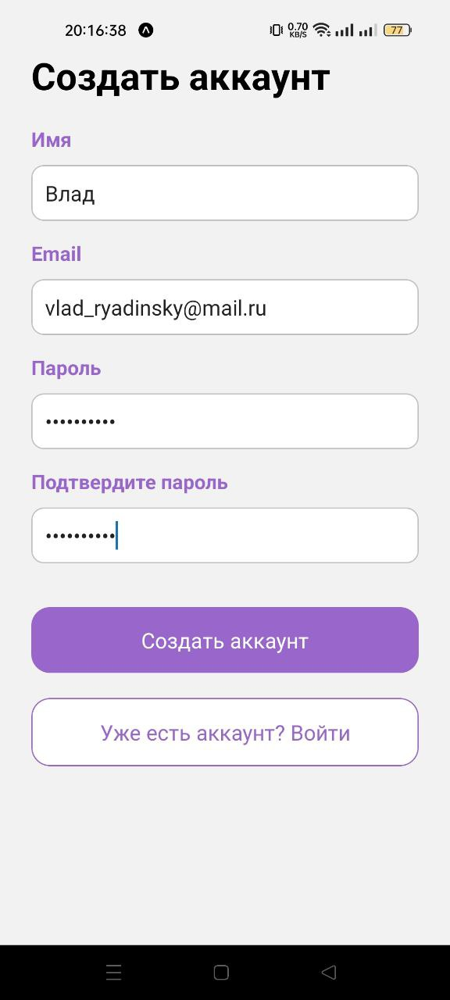|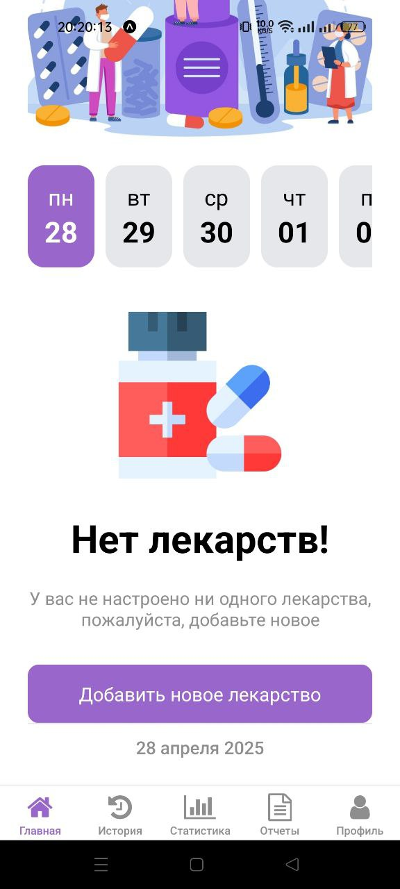|

| Добавления лекарств | Добавления лекарства | Добавленное лекарство | История приема|
|:-------------------------:|:-------------------------:|:-------------------------:|:-------------------------:|
|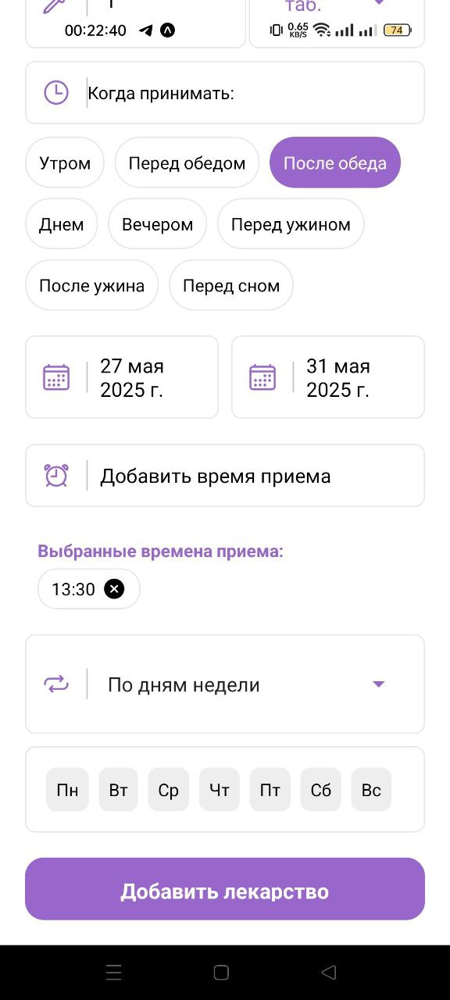|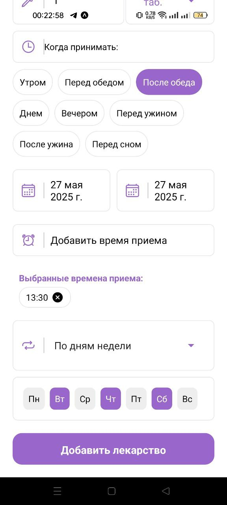|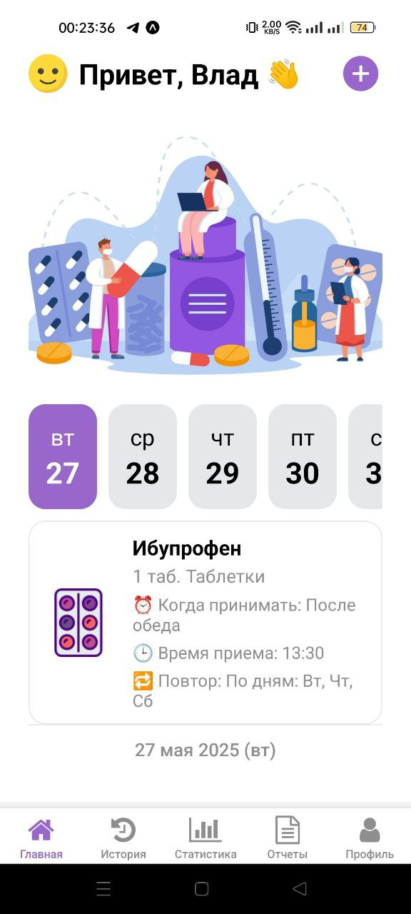|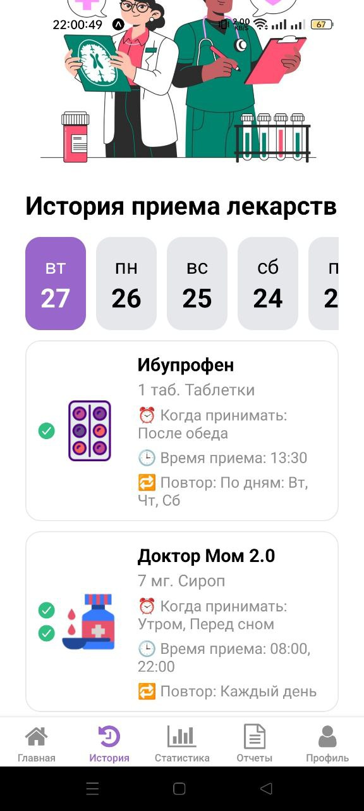|

| Статистики приема | профиль пользователя | Управление лекарствами | Редактирования лекарств|
|:-------------------------:|:-------------------------:|:-------------------------:|:-------------------------:|
|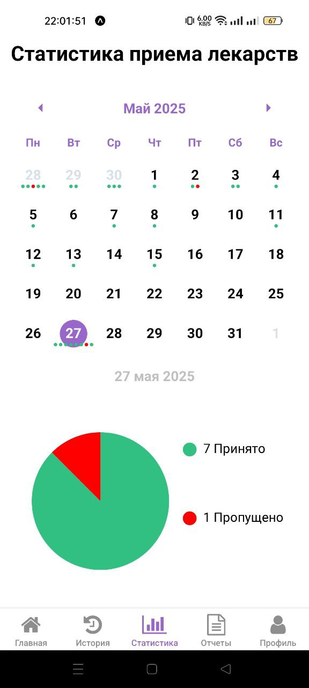|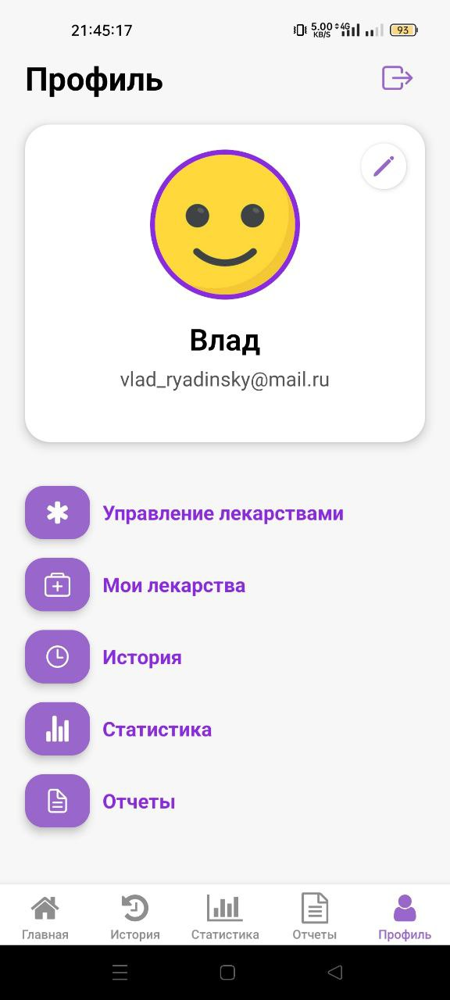|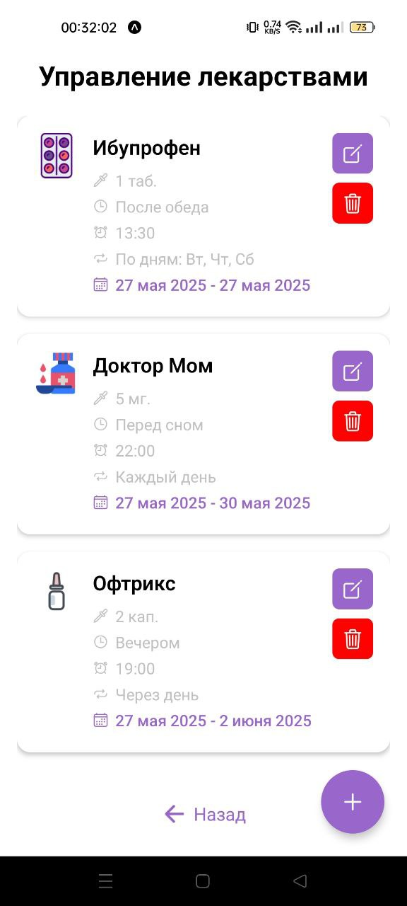|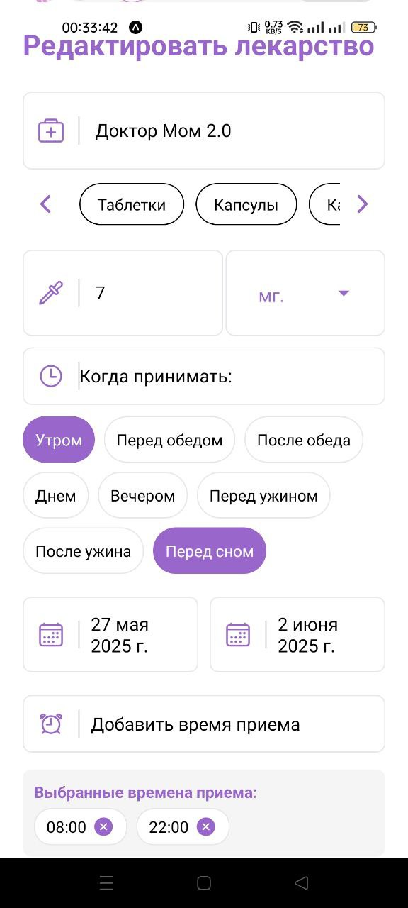|

| Результат редактирования| Экспорта отчета | Push-уведомление | Модальное окно приема|
|:-------------------------:|:-------------------------:|:-------------------------:|:-------------------------:|
|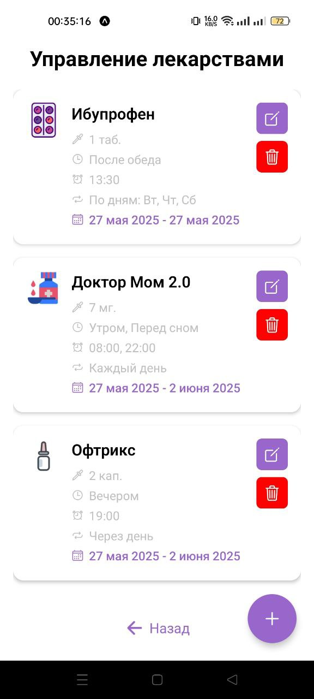|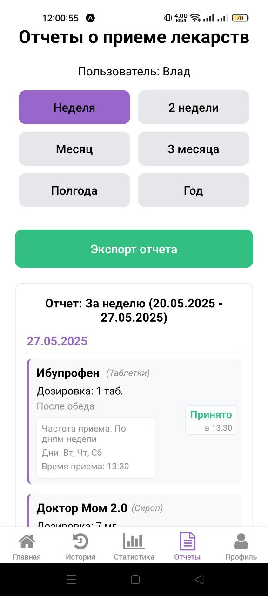|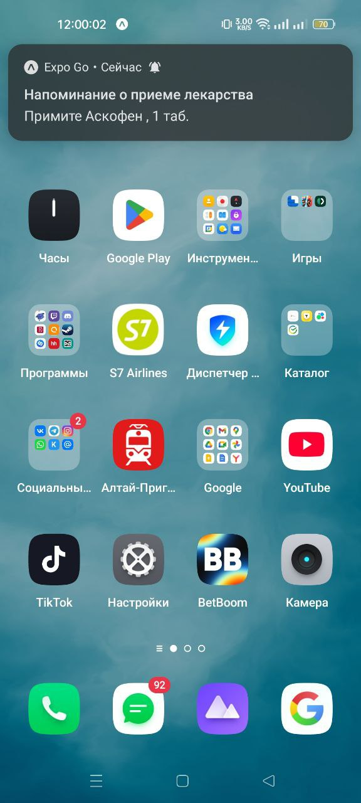||

---

## Используемые технологии 🖥️

### Основные технологии:
- **Язык программирования:** JavaScript
- **Фреймворк:** React Native (через Expo)
- **Серверная часть:** Firebase (Auth, Firestore)
- **Клиентское хранилище:** AsyncStorage
- **UI/UX:** React Native Components, иконки Ionicons, FontAwesome

### Основные библиотеки и модули:

| Название                            | Назначение                                      | Ссылка на ресурс установки                                         |
|-------------------------------------|-------------------------------------------------|--------------------------------------------------------------------|
| `expo`                              | Оболочка для запуска React Native-приложений    | https://docs.expo.dev/get-started/installation/                    |
| `react-native`                      | Основа приложения на JS                         | https://reactnative.dev/                                           |
| `firebase`                          | Бэкенд, аутентификация, база данных Firestore   | https://firebase.google.com/docs/web/setup                         |
| `@react-navigation/native`          | Навигация между экранами                        | https://reactnavigation.org/docs/getting-started/                  |
| `expo-router`                       | Навигация с маршрутизацией файлов               | https://expo.github.io/router/docs                                 |
| `moment`                            | Работа с датами                                 | https://momentjs.com/                                              |
| `expo-notifications`                | Локальные уведомления                           | https://docs.expo.dev/versions/latest/sdk/notifications/           |
| `expo-sharing`                      | Экспорт файлов (CSV-отчеты)                     | https://docs.expo.dev/versions/latest/sdk/sharing/                 |
| `expo-file-system`                  | Работа с файлами (создание и чтение CSV)        | https://docs.expo.dev/versions/latest/sdk/filesystem/              |
| `@expo/vector-icons`                | Иконки Ionicons и FontAwesome                   | https://docs.expo.dev/guides/icons/                                |
| `react-native-calendars`            | Отображение календаря                           | https://github.com/wix/react-native-calendars                      |
| `react-native-chart-kit`            | Построение диаграмм (круговая диаграмма)        | https://github.com/indiespirit/react-native-chart-kit              |
| `@react-native-async-storage/async-storage` | Локальное хранилище данных              | https://react-native-async-storage.github.io/async-storage/        |

---

## С какими сложностями пришлось столкнуться 💪🏻

- Синхронизация данных между приложением и Firebase при изменениях
- Планирование уведомлений с разными повторяющимися шаблонами
- Обработка различных форматов дат при импорте/экспорте
- Оптимизация производительности при работе с большими списками лекарств
- Кросс-платформенные различия в работе на iOS и Android

---

## Что я узнал 💡

- Глубже изучил работу с датами и временем в JavaScript
- На практике освоил интеграцию Firebase с React Native
- Научился работать с Expo Notifications и фоновыми задачами
- Улучшил навыки оптимизации производительности React-приложений
- Освоил создание сложных форм с валидацией
- Научился экспортировать данные в CSV
- Улучшил понимание различий между iOS и Android
- Научился создавать понятные визуализации статистики
---

## Установка и настройка 📲
1. **Клонируйте репозиторий**
   ```sh
   git clone https://github.com/vlad-ryad/Medical-Reminder-App.git
   cd Medicine-app
   ```
2. **Установите зависимости**
   ```sh
   npm install
   ```
3. **Запустите приложение**
   ```sh
   expo start
   ```
4. **Запуск на эмуляторе или устройстве**
   - Нажмите `i`, чтобы открыть iOS-симулятор (требуется Mac)
   - Нажмите `a`, чтобы открыть Android-эмулятор
   - Отсканируйте QR-код с помощью приложения Expo Go на вашем мобильном устройстве
  
## Планы на будущее 🚀
- 🌐 Резервное копирование истории лекарств в облаке
- 📌 Интеграция с носимыми медицинскими устройствами
- 🧾 Добавить функционал "Управление запасами лекарств"
